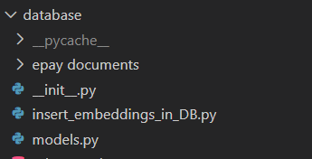

# RAG Chatbot Backend  
**Flask + Ollama + PostgreSQL (pgvector)**

---

##  Tech Stack

- **Backend Framework:** Flask  
- **LLM Provider:** Ollama (Local models)  
- **Database:** PostgreSQL  
- **Vector Extension:** pgvector  
- **Embeddings Model:** intfloat/e5-large-v2  
- **LLM Model Example:** llama3 

---


#  RAG Chatbot Backend  
**Flask + Ollama + PostgreSQL (pgvector)**


##  Tech Stack

- **Backend Framework:** Flask  
- **LLM Provider:** Ollama (Local models)  
- **Database:** PostgreSQL  
- **Vector Extension:** pgvector  
- **Embeddings Model:** intfloat/e5-large-v2  
- **LLM Model Example:** llama3

---

##  Project Structure

```

chatbot/
|_backend/
    │
    ├── app/
    │   ├── scrapers/  #files for scraping websites
    │   ├── database/  #schema and models.py
    │   |__ utils/     # utility files for chatbot
    |   |__uploads/    # documents for chatbot
    ├── .env
    ├── requirements.txt
    ├── app.py
|__ README.md

````

#  Installation Guide

## 1. Clone Repository

```bash
mkdir chatbot
cd chatbot
git clone https://github.com/Bitknox-Solutions/chatbot.git
cd backend
````

---

## 2. Create Virtual Environment

```bash
python -m venv myvenv
```

Activate:

### Windows

```bash
venv\Scripts\activate
```
### Linux/Mac
```bash
source venv/bin/activate
```


## 3. Install Dependencies

```bash
pip install -r requirements.txt
```


#  Setup Ollama

## Install Ollama

Download from:
[https://ollama.com/download](https://ollama.com/download)

Verify installation:

```bash
ollama --version
```

---

## Pull Required Models

```bash

ollama pull llama3
```


## Start Ollama Server

```bash
ollama serve
```

Default API endpoint:

```
http://localhost:11434
```

---

#  PostgreSQL + pgvector Setup

##  Install PostgreSQL and Pgvector 

[https://www.postgresql.org/download/](https://www.postgresql.org/download/)
Follow the steps for pgvector installation: https://github.com/pgvector/pgvector

---

##  4. Create Database

```sql
CREATE DATABASE rag_chatbot;
```

---

##  Enable pgvector Extension

```bash
psql -U postgres -d rag_chatbot
```

```sql
CREATE EXTENSION vector;
```

---

##  Example Table Schema

```sql
Create Tables using schema schema.sql in models/
```

---

# 5. Environment Variables

Create a `.env` file in project root:

```
use example.env as reference
```

---

# 6. Before running chatbot , register the website and insert embeddings 
This is done by running this script insert_embeddings_in_DB.py in database directory
<p align="left">
  
</p>

After running this script you should see :
Connected to database
Website registered (ID: 1)
Starting embedding import...
All embeddings stored successfully.
Deployment initialization complete.

# 7. Run Application

```bash
flask run
```

or

```bash
python run.py
```

App runs on:

```
http://127.0.0.1:5000
```

---

#  RAG Workflow

1. User submits query
2. Query converted to embedding via Ollama embedding model
3. Vector similarity search using pgvector
4. Retrieved context appended to prompt
5. LLM generates final response
6. Response returned to client

---

# API Endpoints

## Health Check

```
GET /health
```


## Chat Endpoint

```
POST /api/chat
```

### Request

```json
{
  "query": "How to sign up for epay balochistan?"
```

### Response

```json
{
  "answer": "To sign up for Epay Balochistan ..."
}
```

---

# Docker Deployment

## Dockerfile

```dockerfile
FROM python:3.14.3
#change python version for your machine

WORKDIR /app
COPY . .

RUN pip install --no-cache-dir -r requirements.txt

EXPOSE 5000

CMD ["gunicorn", "-w", "4", "-b", "0.0.0.0:5000", "run:app"]
```

---

## Build and Run

```bash
docker build -t chatbot .
docker run -p 5000:5000 chatbot
```


# chatbot_platform
This reposiitory is for multi tenant based chatbot platform.
